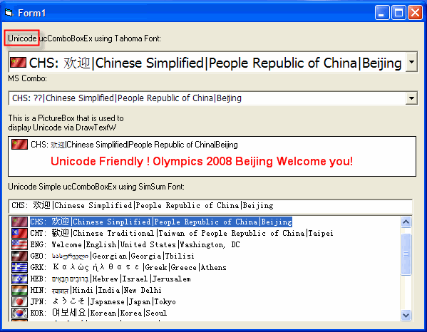



## Unicode ucComboBoxEx

### Description

This is my first attempt to deal with Unicode. Please remember that the code isn't intend to fully duplicate MS Combobox.It just fulfill my application.The purpose of this posting is to bring your attention how important Unicode is and to show you how to develop Unicode control based on MS ComCTL32.DLL. Tested on XP (EN) SP2 and VB6/SP6.

Update 1:Add cImageList Class;Correct Paul's Self-Subclasser Unicode issue;A good Example is here.

Update 2:Revised Demo

Update 3:Heavily rewrite to 'almost' simulate MS Combo

Update 4:Fixed 'Overflow' error when apply Font with Unicode Font name;Add FindItem_Unicode property (28/may/2007)

Update 5:Removed Compilation condition 'Unicode=1'

with auto detection of Windows

Update 6: CreateWindowEx may fail if applied XP Theme with a MANIFEST file. (20/June/2007)

Update 7: Use Paul's Updated Self-Subclass and LaVolpe's more robust Version to solve possible UserControl Terminate error. (20/April/2008)
 
### More Info
 

             |
---                |---
**Submitted On**   |2007-06-27 10:38:36
**By**             |[Zhu JinYong](https://github.com/Planet-Source-Code/PSCIndex/blob/master/ByAuthor/zhu-jinyong.md)
**Level**          |Intermediate
**User Rating**    |5.0 (100 globes from 20 users)
**Compatibility**  |VB 6\.0
**Category**       |[Coding Standards](https://github.com/Planet-Source-Code/PSCIndex/blob/master/ByCategory/coding-standards__1-43.md)
**World**          |[Visual Basic](https://github.com/Planet-Source-Code/PSCIndex/blob/master/ByWorld/visual-basic.md)
**Archive File**   |[Unicode\_uc2110314212008\.zip](https://github.com/Planet-Source-Code/zhu-jinyong-unicode-uccomboboxex__1-66273/archive/master.zip)

